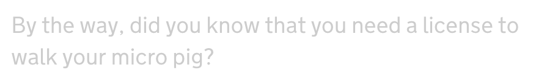

A paragrah of text is written with very light grey on a white background.

## Why it's a problem

* A low colour contrast is difficult to read, not just for people with vision impairments.
* Reading low contrast text on a device in sunshine is difficult to read, straining eyes can induce headaches.

## How to test for it

* Most automated testing tools will find this.

## How to fix it

Increase the contrast so that its ratio meets the minimum requirement of at least 4.5:1 for this type of text. There are various online tools to help with that choice (search for "colour contrast checker") but also various tools embedded into tools you might already be using (like Photoshop, Chrome Inspector, etc),

Providing a mechanism to let the user change the contrast themselves is also an option.
